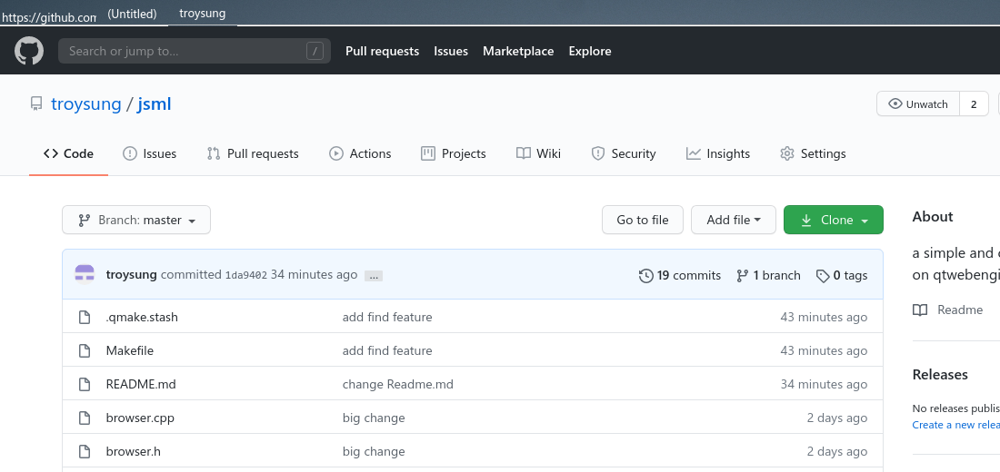
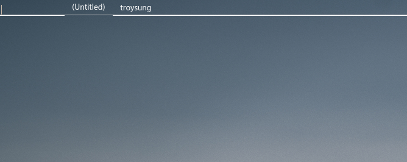
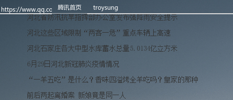
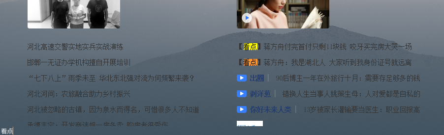

#jsml - just a simple browser
- It`s very simple and beautiful web brower based on qtwebengine,no history, no configuration
- Address input and web page tabs are in the same row. Below them are pure web page.
  1. Double click tabs, corresponding web page closed.
	2. Double click blank places in tab bar,new tab will be built.
- Web contens are transparent,although seldom web sites support this feature nowadays.
	1. Web page background image was set in "/root/Documents/bg.jpg" path.
  2. Righ click is forbidden.
- Short keys
  1. F5 for reload, o for open new file in PC, b for back.
	2. / for find text in current web contents, the FIND column will be hidden when web page was clicked.
- Download
  1. No progress bar
	2. Download link was clicked, and things downloaded into ~/Downloads
- screenshots
  - 
	- 
	- 
	- 

#to-do
- linux tested,windows need to be tested.
